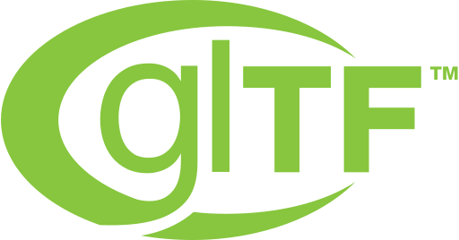
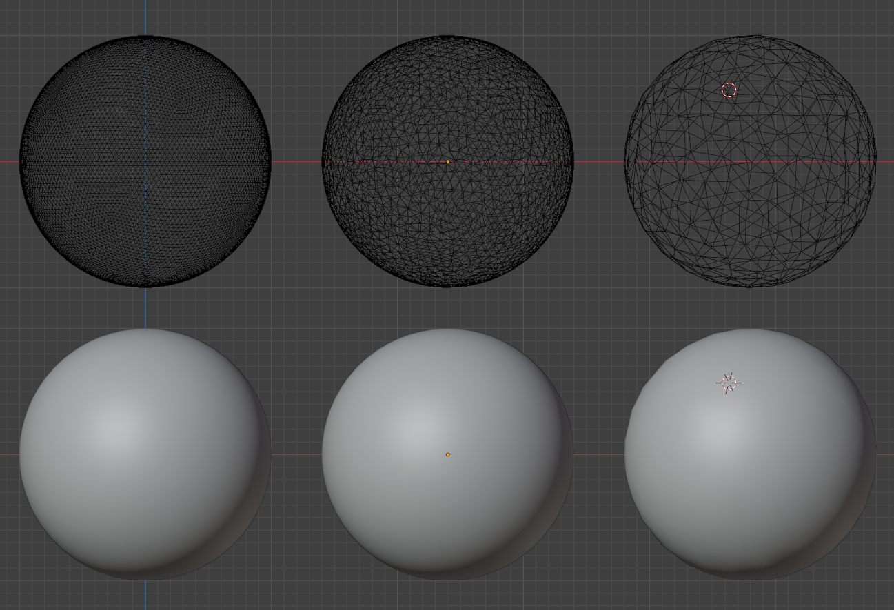
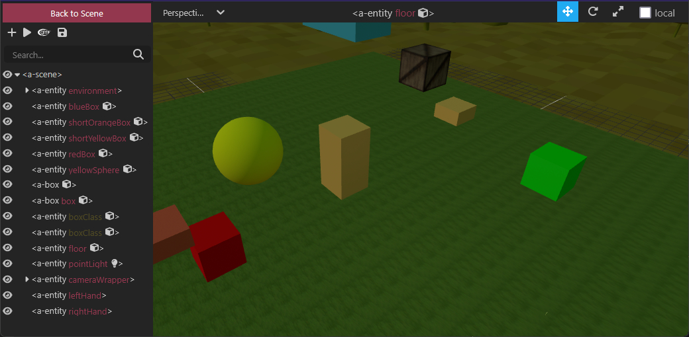
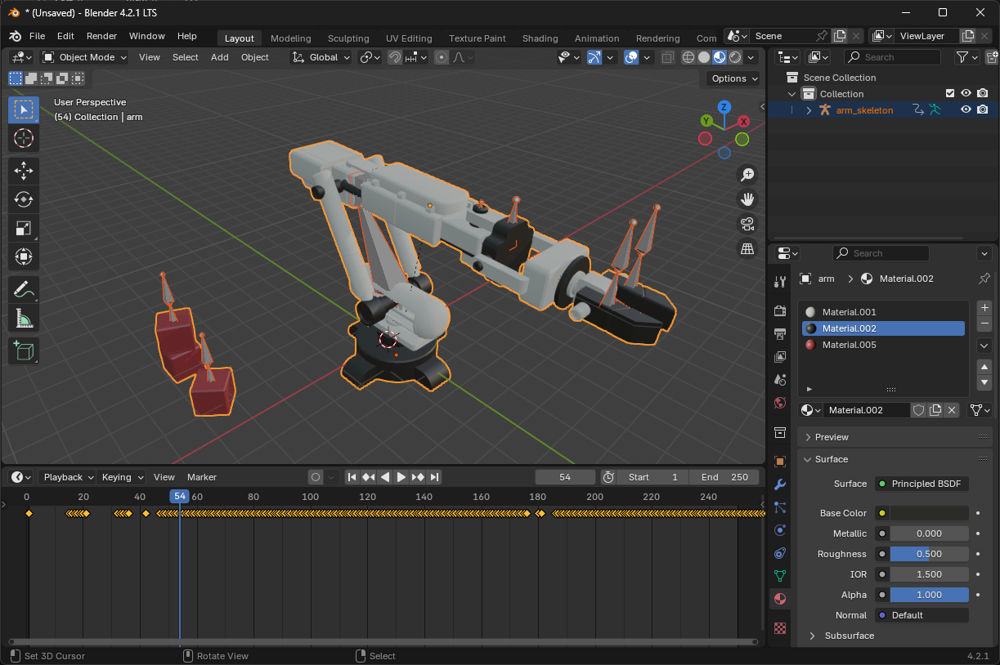
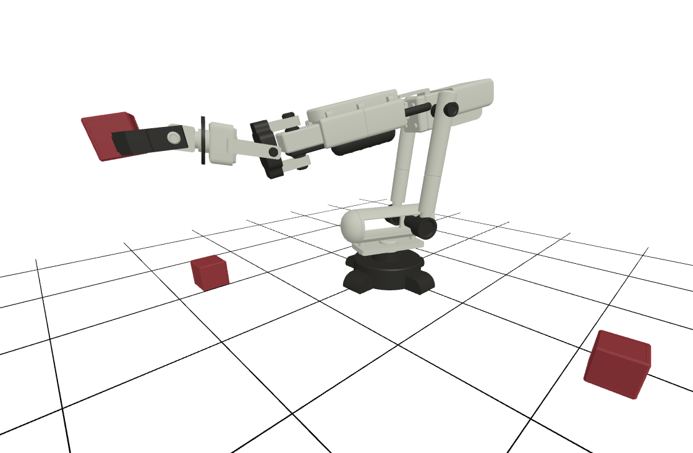

# Bringing your model into XR in minutes using A-Frame

Want to view your 3D models in Virtual or Augmented Reality? This guide will show you how to do it quickly and easily.

## Demonstration

This repository hosts a simple A-Frame demonstration with a moving robotic arm (the `index.html` and `model.glb` files). If you have a Meta Quest 3, you can visit the GitHub Page using this link and click the **VR** button to enter Virtual Reality:

[https://Novia-RDI-XR-Robotics.github.io/a-frame-xr-tutorial/](https://Novia-RDI-XR-Robotics.github.io/a-frame-xr-tutorial/)

## What you'll need


<i>The Meta Quest 3.</i>

You don’t need much to get started. The main requirement is a VR headset. We’ll use the Meta Quest in this guide, but the same principles also apply to other headsets. Some basic knowledge of HTML is helpful, but you don’t need any programming experience. Finally, you’ll need your 3D model in a web-friendly 3D format called **glTF**.

## Opening your web page on a VR headset

To view your scene in VR, you’ll need a way to access your webpage from your headset. Here are three ways to do this:

### Method 1: Host the webpage on your computer

You can run a small web server on your computer to host the content locally. You’ll need to install some server software (like Node.js or Python’s built-in HTTP server), set up HTTPS security (required for WebXR), and make sure your headset is connected to the same wireless network as your computer. Then you can access your content through your computer’s IP address.

### Method 2: Use an online service

You can upload your WebXR project to a free hosting service. GitHub Pages is a great option if you’re comfortable sharing your model publicly. It also supports limiting access to certain users if needed.

#### Hosting on GitHub Pages (Public)

1. Go to GitHub and create a new repository.
2. Upload the website files to the repository.
3. Enable GitHub Pages at *Settings > Pages* (use the **main** branch).
4. Wait a few minutes for GitHub Pages to deploy your site.
5. Open the page on your VR headset: `https://your-username.github.io/name-of-repository/`

### Method 3: Direct USB connection

For the tech-savvy, you can connect your Meta Quest directly to your computer with a USB cable and use the Android Debug Bridge for development. There’s a detailed guide available here: [How to Easily Test WebXR on Oculus Quest](https://medium.com/@lazerwalker/how-to-easily-test-your-webvr-and-webxr-projects-locally-on-your-oculus-quest-eec26a03b7ee)

## Understanding the technology

Before we start building, let’s break down the main technologies we’ll be using.

### What is WebXR?


WebXR is what makes Virtual and Augmented Reality work in web browsers. Instead of downloading an app, you can just visit a website to experience VR or AR content. It works on all kinds of devices—VR headsets like the Meta Quest, AR devices like HoloLens, phones, and regular computers. It’s built right into modern web browsers, making it easy to share your model with others.

### What is A-Frame?


A-Frame makes it easy to create VR and AR content for the web. While other 3D tools require complex programming knowledge, A-Frame lets you build 3D scenes using simple HTML tags—similar to how you’d build a basic webpage. It handles all the complicated 3D graphics behind the scenes. It works great on mobile VR headsets and comes with lots of helpful features built in.

### What is GLTF?



Think of glTF as the JPEG of 3D files—it’s designed specifically for sharing 3D content on the web. It’s widely supported by 3D tools and game engines, can handle models, animations, materials, and textures, and is perfect for VR/AR experiences. It comes in two flavors: **.gltf** (which keeps textures as separate files) and **.glb** (which packages everything into one file).

## Setting up your project

### Preparing your 3D Model

Before we create your VR scene, we need to get your 3D model ready. Here’s what you need to know:

First, consider performance. VR headsets work best with simpler models—aim for fewer than 100,000 vertices (the points that make up your 3D model). Many 3D modeling programs can tell you how many vertices your model has and help you simplify it if needed. Programs like Blender, Maya, and 3ds Max all have [tools to reduce model complexity](https://www.youtube.com/watch?v=rHWCCYWhCMA) while keeping the important details.



<i>Decimation of a sphere in Blender.</i>

When saving your model, you have two main format choices. The **.gltf** format saves textures as separate files, while **.glb** combines everything into one. **.glb** is usually easier to work with in A-Frame because you only have one file to manage.

Your model can include animations—things like moving parts, rotating elements, or character movements. glTF supports all kinds of animations, from simple position changes to complex character movements. By default, A-Frame will play these animations on a loop.

Materials and textures work well, too. You can have colors, metallic surfaces, rough or smooth finishes, glowing effects, and transparent parts. All these properties will carry over when you view your model in VR.

When exporting your model, try to export directly to **.glTF** or **.glb** if your software supports it. If not, use formats like COLLADA (**.dae**) or **.fbx** as an intermediate step. Avoid simpler formats like **.obj** or **.stl**, as they don’t preserve the individual objects and materials in your model.

For specific instructions on exporting from your 3D software, check out the [official Khronos glTF guidelines](https://www.khronos.org/gltf/).

### About A-Frame

A-Frame makes it easy to create VR experiences without needing to be a programming expert. While other 3D web tools require deep knowledge of JavaScript and complex graphics programming, A-Frame lets you build scenes using simple HTML-style code.

A-Frame comes with everything you need to get started: basic shapes, ways to manage your 3D models and other assets, animation tools, camera controls, and lighting effects. When you need more advanced features, there’s a large collection of add-ons created by the community for things like physics simulations, multiplayer experiences, hand tracking, special effects, user interfaces, and sound visualization.



<i>Scene overview in the A-Frame editor.</i>

Mozilla maintains A-Frame, and there’s a large community of developers creating tutorials, components, and tools. You can find many ready-to-use components in the [A-Frame Registry](https://aframe.io/aframe-registry/), and stay up to date with the latest developments on the [A-Frame Blog](https://aframe.io/blog/).

## Let's get started

Now that you understand the basics (or at least have a good idea of what you need), let’s create your first VR scene!

### Project setup

Creating your first VR scene is very simple. First, create a new folder for your project files. Then download the A-Frame library. You’ll want the file called `aframe.min.js` from the [latest A-Frame Release](https://github.com/aframevr/aframe/releases). Put this file in your project folder. If you want animations, you also need to copy `aframe-extras.min.js` from the [A-Frame extras repository](https://github.com/c-frame/aframe-extras).

Then, copy your 3D model file into the same folder. If your model includes textures, make sure you’re using the **.glb** format so everything is packaged into one file.



<i>The animated robot is exported as a **.glb** file using Blender.</i>

After that, you can start creating the main file for your project. In a text editor, create a new file called `index.html` and put this code in it:

```html
<!DOCTYPE html>
<html>
    <head>
        <script src="aframe.min.js"></script>
    </head>
    <body>
        <a-scene>
            <a-entity gltf-model="url(model.glb)"></a-entity>
        </a-scene>
    </body>
</html>
```

Your project folder should now look like this:

```
my-project/
├── aframe.min.js
├── aframe-extras.min.js
├── model.glb
├── index.html
```

Open the `index.html` file in your browser by double-clicking it. You should now see your 3D model.

#### Using animations

If your glTF file has an animation, you can play it by adding an `animation-mixer` from A-Frame Extras:

```html
<!DOCTYPE html>
<html>
    <head>
        <script src="aframe.min.js"></script>
        <script src="aframe-extras.min.js"></script>
    </head>
    <body>
        <a-scene>
            <a-entity gltf-model="url(model.glb)" animation-mixer></a-entity>
        </a-scene>
    </body>
</html>
```

Now the model’s animation will play in an infinite loop as soon as you open the scene.



#### Using Virtual Reality

To make the scene work for **Virtual Reality**, add the following code to your `index.html` file:

```html
<!DOCTYPE html>
<html>
    <head>
        <script src="aframe.min.js"></script>
        <script src="aframe-extras.min.js"></script>
    </head>
    <body>
        <a-scene
            xrweb="mode: immersive-ar; requiredFeatures: hit-test;"
            xr-mode-ui="enabled: true; enterAREnabled: true; XRMode: ar;"
            embedded>
            <a-entity gltf-model="url(model.glb)" animation-mixer></a-entity>
        </a-scene>
    </body>
</html>
```

With this code, your model can be viewed in Augmented Reality on your Meta Quest.

### Conclusion

That concludes this tutorial. I hope it gives you a good idea of how to get started with A-Frame.

There are many more features you can explore in the [A-Frame examples](https://aframe.io/aframe/examples/). Since A-Frame is built on top of [three.js](https://threejs.org/), you can also look at the [three.js examples](https://threejs.org/examples/), which can be adapted to A-Frame with a bit of JavaScript programming.

